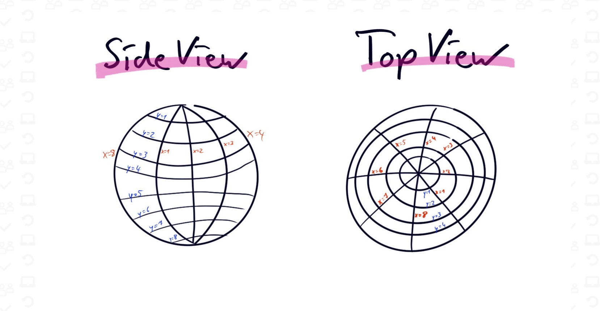

=====Jun 29

Package json
Semver
More in depth static testing tools

Bowling solution >> pending

Pair Programming => https://www.codementor.io/pair-programming

- Ping Pong => 1 test, 1 code
- Driver (types, corrects instructions ) - Navigator (instructs) => https://www.codementor.io/pair-programming
- Unstructured Pairing

Exercise => https://kata-log.rocks/mars-rover-kata

Your Task
You’re part of the team that explores Mars by sending remotely controlled vehicles to the surface of the planet. Develop an API that translates the commands sent from earth to instructions that are understood by the rover.

Requirements
You are given the initial starting point (x,y) of a rover and the direction (N,S,E,W) it is facing.
The rover receives a character array of commands. for example = ['f', 'l', 'f', 'f', 'r', 'b']
Implement commands that move the rover forward/backward (f,b).
Implement commands that turn the rover left/right (l,r).
Implement wrapping at edges. But be careful, planets are spheres.
Implement obstacle detection before each move to a new square. If a given sequence of commands encounters an obstacle,
the rover moves up to the last possible point, aborts the sequence and reports the obstacle.

