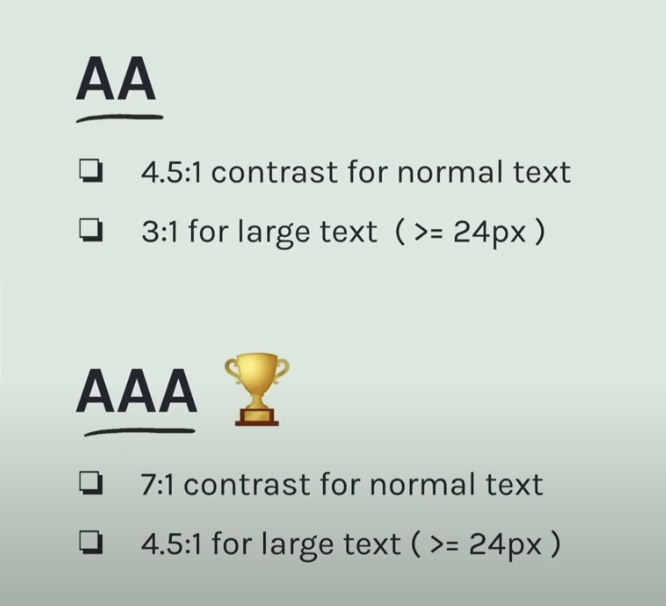
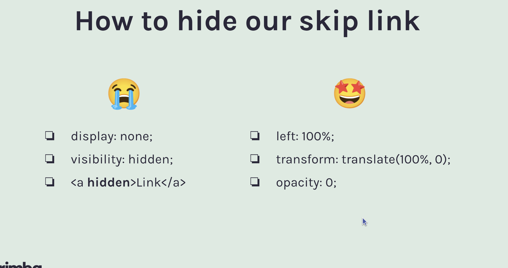
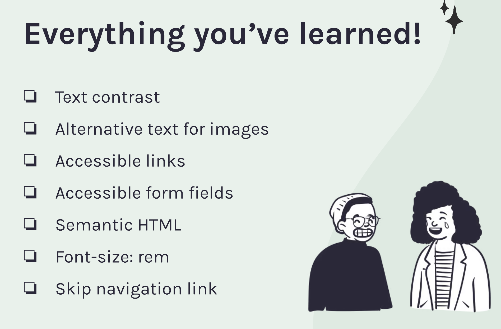

#Accesibility

## Intro :

Accesbility makes web available for everyone

## assistive technologies :

1.  Screen readers
2.  Speech recognition software
3.  Screen magnifiers
4.  Alternative input devices

## Accesibility Tree:

1.  How browsers interacts with assistive technologies

## Semantic HTML:

Semantic html feeds right information to the accesibility tree
keyboard accesibility for free [Semantic HTML](https://www.semrush.com/blog/semantic-html5-guide/?kw=&cmp=LM_SRCH_DSA_Blog_EN&label=dsa_pagefeed&Network=g&Device=c&utm_content=676326049412&kwid=dsa-2185834090056&cmpid=18364824154&agpid=154189721973&BU=Core&extid=147058653905&adpos=&gad_source=1&gclid=CjwKCAjwnK60BhA9EiwAmpHZw9Y27e7iq8UjzjuJGBnqC2Tfj8Vbd0Ej-CRMtlL7vQ0dn3lIC6K0xhoCPiUQAvD_BwE)

### Structure Semantic :

- Header : Introductory Info for the page
- main : Maing content of the page, only one per page
- Nav : Navigation links
- Section : Grouping neary content of a similar theme
- Article : Can stand independently of the page by it's own
- Aside : Secondary information
- Footer : Bottom section in the page

### Text Semantic :

- h1: top level heading
- h2: subheadings
- p : standalone paragraph
- a : mark up a hyperlink
- ol: order list
- ul : unorder list
- q : blockquote
- em : emphasis
- strong : strong emphasis

## Enable accesibility tree in chrome :

Go to accesibility tab and chack enable accesibility tree

## Test accesbility :

Use screen reader
Contrast checker
Automated tools => LightHouse, Accesibility Inspector, aXe, AI assistants

## Text Contrast:

-A, AA, AAA
Command + Shift + P => Show CSS overview, look at contrast issues

- combine color with text or shapes to convey messges



For accesible backgrounds use =>`background-blend-mode`

```
.blended-background {
  background-image: url('image.jpg');
  background-color: rgba(255, 0, 0, 0.5); /* Red with 50% opacity */
  background-blend-mode: multiply;
}
```

## Images :

Alternative text for images :

Alternative images to al images (no if the image is decorative)

Links : `<a></a>`, non ambiguos text, recognazible as links, color alone it is not enough
you should use color and underline

Aside Links =>

               ` <section class="astronaut-section card">
                    <p>Inspired by creative minds like Hideo Kojima, the artist offers a collection of otherwordly art that makes us contemplate about our place in the cosmos, where we are heading, and if the glow cloud of Night Vale is friend or foe.☁ <b class="cta">Check out more of their awesome art by clicking this card.</b></p>
                    
                    <a href="https://unsplash.com/@shaarannnnn" target="_blank" aria-label="Check out more of this artist's otherwordly art"></a>
                </section>`

, buttons =>

Radio buttons should be group in fieldsets

use nav, footer, seciotn, header,

use ul , il for concesutive concecte items

font size => use rem

Headings=> Heading goes consecutive, only on h1 per page, apply them for stucture not style

ARIA => Accesible Rich Internet Applications, buttton native doesn need aria labels, first tule of aria dont use aria
<button id="toggleTheme" onclick="toggleTheme()" role="switch" aria-checked="false">Light Mode</button>
aria live regions => dynamicaaly updates. live time notifications, dynamic messge s form

aria controls connect the caus eleent y de effect element

aria-live="off" "polite" "polite"
<button class="contact-submit-button" id="submitButton" type="button" onclick="sendMessage()" aria-controls="submitMessage">Send message 🎉</button>

<p id="submitMessage" class="submit-message" aria-live="polite">Message sent! ✅</p>

Programatic focus management=> when opening modals or menus, after completing actions like form submitions, to mantain a logical flow of navigation

    document.getElementById('homeLink').focus();

    Live regions and focues only for esential flows

Accesible JS =>

Hiding content =>

Many modals are inaccesbile

Skip Navigation Link =>

Accesible links


