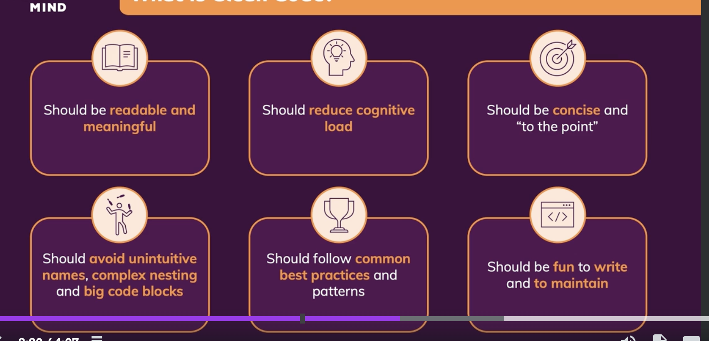

# Clean Code

Build code easy to rad and easy to mantain

## Var naming and conventions

Names should convey meaning => you should understand what does the variable holds without exploring the code
the intent should be clear

### choosing good names =>

    variables - constants => nouns, adjectives (userData, isValid)

    functions (makes an action , returns a boolean)=> verbs, sendData, inputIsValid

    Class, Interfaces  => Nouns, Short Phrases With Nouns  (User, RequestBody)

### Cases :

    snake_case, PascalCase (Classes), camelCase (vars, functions), kebab-case

### Naming

    Objects, Variables =>  describe the value, introduce details without redundancy => user, userAuthenticated
    Boolean  => Answer yes no quesiton, isLogged in, log in

    exceptions =>
    

### Pitfalls

    - don't include redundant info => const userWithNameAndAge = user("name", 23)
    - Slang
    abreviations => action.diePlease() => action.remove()
    - desinformations => userList = { u1 : "" , u2 : ""} => users, userMap , allAcounts = accounts.filter()=? filteredAccounts
    - chosse distinctive names => analytics.getDailyData() ; analytics.getRawDAilyData() => analitics.getDailyReport(); getRawFullData()
    - be consistent => getUSers  , fetchUsers , retreiveUsers
    - for interfaces use singular PascalCase Words

### Vs Code Multicursor :

Option + Click: Add a new cursor at the clicked position.
Cmd + Option + Down Arrow / Cmd + Option + Up Arrow: Add a new cursor below/above the current cursor.
Cmd + D: Add the next occurrence of the selected text to the selection.
Cmd + Shift + L: Select all occurrences of the current selection.

## Comments

### Bad comments

1.  You should try to avoid them in general, code should be self explanatory, they can cluttered your code
2.  Divider Comments are bad you should create another file
3.  use good names
4.  some comments can be misleading and they are hard to keep in sync
5.  Commented out code

### Good Comments :

1. Legal disclaimer
2. explanations for code that can be eeasily undertood with good naming
3. add recomendation or warnings that aren't obvious
4. add Todos
5. Add documentation Js docs, Apis etc (jsdocs)[https://jsdoc.app/about-getting-started]

### Code formatting :

1. Splits code in different files for different concepts
2. Different areas separated by spacing
3. keep relateed methods close
4. use descriptibe names but not too long ones => storagePathForStoringImagesInATemporaryFolderFor2020 = store (image, 2020)(can hide the rest of the line )

### Clean Functions :

1. function and call of the function should be readable, order and amount of arguments matters
2. minimize numbers of parameters, 2 -> use with caution, 3 try to avoid, >3 avoid always
3. Exception => functions with dynamic # of arguments
4. split function when necesary if necesary
5. try to avoid , void outputs (impure functions)
6. function should be small and do one thing => levels of abstracion => High level (declarative mode), low level (implementation details )
7. when to split => split for chunks of codes that works in the same funcionality , extract code that needs more interpretation the it's sorrounding code
8. DRY
9. avoid useless abstactions, split reasonable , beign as granular as possible wont't improve your code readability
   dont splid if => you are just renaming , finding the new function will take longer than reading the code, can't find a reasonable name for the abstaction
10. avoid side effects => purity, problems side effect are unexpected, pure functions are more predictable and testable
11. for functions with side effect the name of the function shoud imply the side effect or move the side effect to othe function where it is expected, (isValid => expected, saveUser => notExpected)

side effect change the overall system state

## Control Structures and Erros

1. Prefer positive checks over negative checks , avoid deep nesting, factory functions and polymorphism
2. utilize error to get rid off unnecesary if checks
3. use guard clauses
4. work with default parameters to avoid if checks

### References

[clean code guide](https://github.com/andersontr15/clean-code-javascript-es)

[udemy course](https://www.udemy.com/course/writing-clean-code)

[clean code uncle bob](https://www.amazon.com/Clean-Code-Handbook-Software-Craftsmanship/dp/0132350882)
